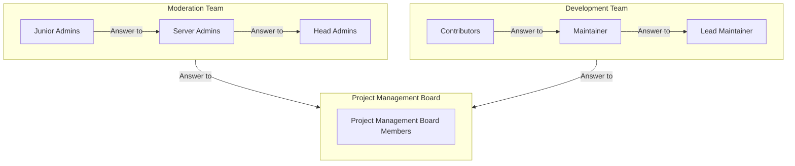

# RonStation's Hierarchy

```mermaid
flowchart TD
    %% Mod Team
    subgraph ModTeam["Moderation Team"]
        Trialmin[Junior Admins]
        Admin[Server Admins]
        Oldmin[Head Admins]
    end

    Trialmin --"Answer to"--> Admin
    Admin --"Answer to"--> Oldmin

    %% Dev team
    subgraph DevTeam["Development Team"]
        Contrib[Contributors] 
        Maint[Maintainer]
        LM[Lead Maintainer]
    end

    Contrib --"Answer to"--> Maint
    Maint --"Answer to"--> LM

    %% Project Management Board
    subgraph PMB["Project Management Board"]
        PMBM[Project Management Board Members]
    end
    ModTeam --"Answer to" --> PMB
    DevTeam --"Answer to" --> PMB
```

## Project Management Board

TODO